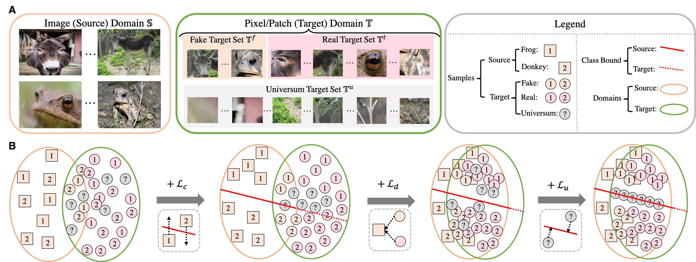
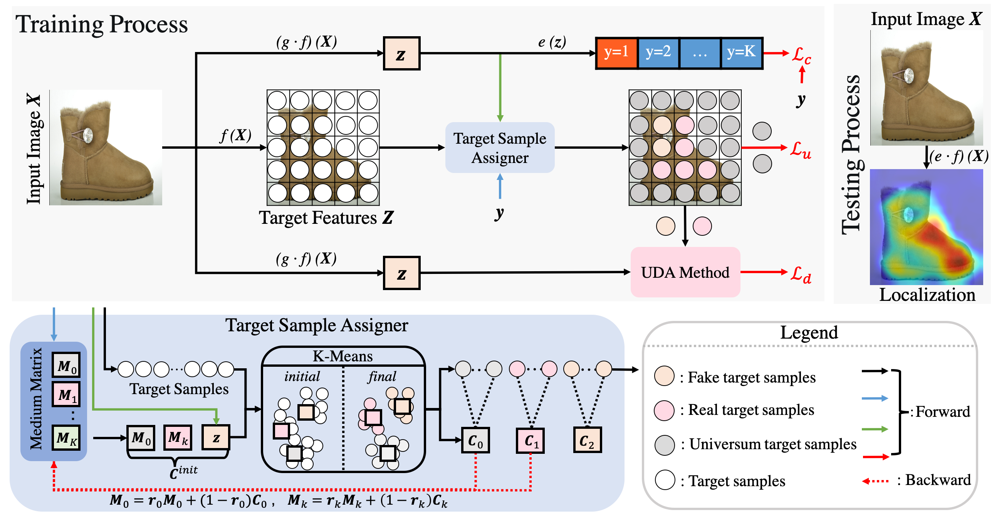

# DA-WSOL_CVPR2022

## Overview
Official implementation of the paper  ``[Weakly Supervised Object Localization as Domain Adaption][paper_url]" (CVPR'22) 

## Assisting WSOL with Domain Adaption

The WSOL aims at training a feature extractor and a classifier based on the CE between image-level features and image-level annotation. This classifier is then projected onto pixel-level features in the test time to generate pixel-level classification results, i.e., the localization map. 

The training and test processes of WSOL focue on features from different domains (image features for training and pixel features for testing), thus our work view the WSOL as a domain adaption task with specific property and design a Domain Adaptive Localiztion (DAL) loss to assist existing WSOL with DA methods.

Our DA-WSOL pipeline can be easily engaged into current WSOL methods to train them with the proposed DAL loss by inserting a proposed Target Sampling Assigner (TSA) to assign the target samples into three sub-sets.

## Getting Start

### Prepare the dataset

1. Downloading the train/test split and bounding-boxes annotation for CUB-200, OpenImages, ILSVRC dataset from [our google drive][meta_url]. 

2. Dowinloading source images and pixel-level localiztion masks of these three datasets from: 
      CUB-200 dataset: [source images][cub_image_url],  [segmentation mask][cub_mask_url]
      OpenImages dataset: [source images][open_image_url], [segmentation mask][open_mask_url]
      ILSVRC dataset: [source_images][ilsvrc_url]

3. Putting these three dataset into "$dataroot" with following layout:
 
      |--CUB 
      |    |--001.Black_footed_Albatross
      |    |--002.Laysan_Albatross
      |    |--....

      |--CUBMask
      |    |--imgs
      |    |  |--001.Black_footed_Albatross
      |    |  |--002.Laysan_Albatross
      |    |  |--....
      |    |
      |    |--masks
      |    |   |--001.Black_footed_Albatross
      |    |   |--002.Laysan_Albatross
      |    |   |--....

      |--OpenImages
      |   |--train
      |   |   |--01226z
      |   |   |--018xm
      |   |   |--....
      |   |--val
      |   |   |--01226z
      |   |   |--018xm
      |   |   |--....
      |   |--test
      |   |    |--01226z
      |   |    |--018xm
      |   |    |--....

      |--ILSVRC
          |--train
          |   |---n01440764
          |   |---01443537
          |   |---...
          |--val
          |    |--ILSVRC2012_val_00000001.JPEG
          |    |--ILSVRC2012_val_00000002.JPEG
          |    |--....

### Training our DA-WSOL

1. Confirming ``$data_root" is set as the folder of datasets that has been arranged as mentioned above.

2. Setting ``--dataset_name" as the dataset used for training (OpenImages, CUB, or ILSVRC)

3. Setting ``--architecture" to choose the feature extractor (resnet50 or inception_v3)

4. Setting ``--wsol_method" to choose the baseline WSOL methods (cam, has, cutmix, or adl)

5. Setting ``--uda_method" to choose the DA methods (mmd or dann)

6. Setting ``--beta" as the strength for the DA methods, i.e., lambda_1 in our paper.

7. Setting ``--univer" as the strength of Universum regularization, i.e., lambda_2 in our paper.

8. Running ``bash run_train.sh"

9. Training log files and checkpoint are save in "--save_dir"

### Testing our DA-WSOL

1. Confirming ``$data_root" is set as the folder of datasets that has been arranged as mentioned above.

2. Downloading our checkpoint from [our google drive][checkpoint_url]. 

3. Setting ``--check_path" as the path of the checkpoint generated by training process or our released checkpoint.

4. Confirming the ``--architecture", ``--wsol_method" and ``--uda_method" are consist with the setting for the trained checkpoint.

5. Running ``bash run_test.sh"

6. Test log files and test scores are save in "--save_dir"

### Performance

[2022/0325] We have solved some issues in our codes, now the corresponding scores of our checkpoints are listed.
[2022/0719] Including more post-method for generating localization maps for DA-WSOL (refer to our latest work [BagCAMs][bagcams_url])

#### ILSVRC Dataset

|| Top-1 Loc | GT-known Loc | MaxBoxAccV2 | 
| :----: |:----: |:----: |:----: |
|DA-WSOL-ResNet-One-Stage| 43.26 | 70.27 | 68.23 | 
|DA-WSOL-ResNet-Two-Stage| 55.84 | 70.27 | 68.23 | 
|DA-WSOL-InceptionV3-Two-Stage| 52.70 | 69.11 | 64.75 | 

#### CUB-200 Dataset

|| Top-1 Loc | GT-known Loc | MaxBoxAccV2| pIoU | PxAP
| :----: |:----: |:----: |:----: |:----: |:----: |
|DA-WSOL-ResNet-One-Stage| 62.40 | 81.83 | 69.87 | 56.18 | 74.70 |
|DA-WSOL-ResNet-Two-Stage| 66.65 | 81.83 | 69.87 | 56.18 | 74.70 |
|DA-WSOL-InceptionV3-Two-Stage| 65.94 | 80.03 | 68.01 | 51.81| 71.03 |

#### OpenImage dataset

|| pIoU | PxAP |
| :----: |:----: |:----: |
|DA-WSOL-ResNet| 49.68 | 65.42 | 
|DA-WSOL-InceptionV3| 48.01 | 64.46 |

### Citation

@article\{DAWSOL, 
  title=\{Weakly Supervised Object Localization as Domain Adaption\}, 
  author=\{Zhu, Lei and She, Qi and Chen, Qian and You, Yunfei and Wang, Boyu and Lu, Yanye\}, 
  booktitle=\{Proceedings of the IEEE/CVF Conference on Computer Vision and Pattern Recognition\}, 
  pages=\{14637--14646\}, 
  year=\{2022\} 
\}

@article\{BagCAMs, 
  title=\{Bagging Regional Classification Activation Maps for Weakly Supervised Object Localization\}, 
  author=\{Zhu, Lei and Chen, Qian and Jin, Lujia and You, Yunfei and Lu, Yanye\}, 
  journal=\{arXiv preprint arXiv:2207.07818\}, 
  year=\{2022\} 
\}

### Acknowledgement
This code and our experiments are conducted based on the release code of [wsolevaluation][EVAL_url] / [transferlearning][tl_url]. Here we thank for their remarkable works.

[EVAL_url]: https://github.com/clovaai/wsolevaluation
[tl_url]: https://github.com/jindongwang/transferlearning
[bagcams_url]: https://github.com/zh460045050/BagCAMs

[paper_url]: https://arxiv.org/abs/2203.01714
[checkpoint_url]: https://drive.google.com/drive/folders/1NLrTq8kllz46ESfBSWJFZ638PKPDXLQ1?usp=sharing
[meta_url]: https://drive.google.com/drive/folders/1xQAjoLyD96vRd6OSF72TAGDdGOLVJ0yE?usp=sharing
[cub_image_url]: https://drive.google.com/file/d/1U6cwKHS65wayT9FFvoLIA8cn1k0Ot2M1/view?usp=drive_open
[cub_mask_url]: https://drive.google.com/file/d/1KZQLpwkuF0HgmJ04P9N9lmYvvGU9-ACP/view?usp=sharing
[open_image_url]: https://drive.google.com/file/d/1oOb4WQ-lb8SYppHEg3lWnpHk1X8WVO4e/view
[open_mask_url]: https://drive.google.com/file/d/1eu1YvcZlsEalhXTS_5Ni5tkImCliIPie/view
[ilsvrc_url]: https://image-net.org

